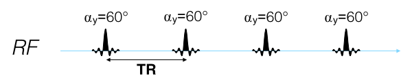
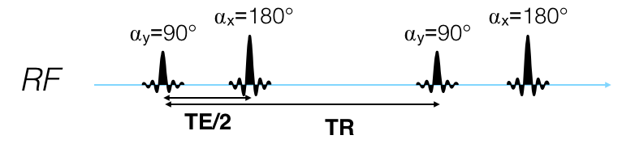

# TP IRM SIMULATION
*Aurélien Trotier*, 2023

---

Le signal IRM peut-être représenté grâce à l'équation de Bloch :

$$\begin{equation}
\frac{d\vec{M}}{dt} = \gamma \vec{M} \times \vec{B}_{ext} + \frac{1}{T_1} (M_0 - M_z)\vec{z} - \frac{1}{T_2} \vec{M}_\perp
\end{equation}$$

Cette équation peut être résolue dans des cas simples :
- Rotation sans relaxation (matrice de rotation 3x3 selon l'axe X/Y/Z)
- Relaxation + off-resonance (équivalent à une rotation selon l'axe Z)

$$\begin{equation}
\begin{split}
\vec{M}(t+dt) &= \begin{bmatrix} E_2 & 0 & 0 \\ 0 & E_2 & 0 \\ 0 & 0 & E_1 \end{bmatrix}\vec{M}(t) +\begin{bmatrix} 0 \\ 0 \\ M_0(1-E_1) \end{bmatrix} \\
&= A \ \vec{M}(t) +B
\end{split}
\end{equation}$$

où $E_2 = \exp{(-dt/T2)}$ et $E_1 = \exp{(-dt/T1)}$ 

Pour calculer plusieurs étapes de relaxation on va donc calculer les opérateurs A et B en fonction des temps de repousse /  T1 et T2 puis on les combineras de la manière suivante :

$$\begin{equation}
\begin{split}
\vec{M}(dt_1 + dt_2) &= A_2 \vec{M}(dt_1) + B_2 \\ 
&= A_2 (A_1 \ \vec{M_0} + B_1) + B_2
\end{split}
\end{equation}$$

Cette équation est non linéaire mais peut-être homogénéisée avec une matrice 4x4 :

$$\begin{equation}
A = \begin{bmatrix}
E2 & 0 & 0 & 0\\
0 & E2 & 0 & 0\\
0 & 0 & E1 & 1-E1\\
0 & 0 & 0 & 1
\end{bmatrix}
\end{equation}$$

qui donne alors : 
$$\begin{equation}
\begin{split}
\vec{M}(dt_1 + dt_2) &= A_2 \ A_1\vec{M_0}(dt_1)
\end{split}
\end{equation}$$

# 1. Préparation des sous-fonctions
Préparez les opérateurs nécessaires à la simulation du signal IRM en matrice 4x4 :

- xrot(angle), yrot(angle) et zrot(angle) : qui retourne une matrice de rotation à partir d'un angle (en radian)

- freeprecess(t,T1,T2,df) : calcul des opérateurs de relaxation en fonction du T1(ms) et T2(ms), de l'off-resonance (Hz) de l'isochromat df durant un délai t (ms)

## Rotation
Les matrices de rotation 3x3 peuvent être trouvé sur wikipédia. Ajoutez uneValidez que celle-ci fonctionne correctement :

$$\begin{equation}
\begin{split}
xrot(\pi) &= 
\begin{bmatrix}
1 && 0 && 0 \\
0 && -1 && 0 \\
0 && 0 && -1
\end{bmatrix} \\
yrot(\pi) &= \begin{bmatrix}
-1 && 0 && 0 \\
0 && 1 && 0 \\
0 && 0 && -1
\end{bmatrix} \\
zrot(\pi) &= \begin{bmatrix}
-1 && 0 && 0 \\
0 && -1 && 0 \\
0 && 0 && 1
\end{bmatrix}
\end{split}
\end{equation}$$

Modifiez les fonctions en matrice 4x4 en ajoutant une ligne et colonne composée de zéros sauf pour la position (4,4) qui sera égale à 1. Vérifiez à nouveau les valeurs.

## Relaxation

> A = freeprecess(t,T1,T2,df)

- Implémentez l'équation 4 et validez que le résultat :

$$\begin{equation}
\begin{split}
&freeprecess(50,500,100,0)\\
& \ \ \ \ = 
\begin{bmatrix}
 0.61 && 0.0    &&   0.0   &&    0.0 \\
 0.0   &&    0.61 && 0.0    &&   0.0 \\
 0.0   &&    0.0    &&   0.91 && 0.095 \\
 0.0   &&    0.0    &&   0.0   &&    1.0
\end{bmatrix}
\end{split}
\end{equation}$$

- Dans cette fonction : ajoutez une rotation selon l'axe Z qui correspond à l'application se l'off-resonance (le fait que l'aimantation tourne +/- vite que la fréquence $f_0 = \frac{\gamma}{2\pi}B_0$. La rotation est à appliqué sur l'opérateur de relaxation : $zrot(phi) \times A$.

**Attention :**
> Le paramètre d'off-resonance (Hz) doit être converti en un angle (Utilisez le paramètre t)

$$\begin{equation}
\begin{split}
&freeprecess(50,500,100,10)\\
& \ \ \ \ = 
\begin{bmatrix}
 -0.49 && 0.35    &&   0.0   &&    0.0 \\
 -0.36   &&    -0.49 && 0.0    &&   0.0 \\
 0.0   &&    0.0    &&   0.91 && 0.095 \\
 0.0   &&    0.0    &&   0.0   &&    1.0
\end{bmatrix}
\end{split}
\end{equation}$$


# 2. Signal de précession libre
Simuler 2 signaux de precession libre (correspondant à l'évolution du signal après une impulsion radiofréquence)  avec une valeur d'off-resonance de 0 ou 10 Hz :

- $angle = \frac{\pi}{2}$ correspondant à une aimantation de départ selon l'axe $\vec{M_0} = \begin{bmatrix}
   0\\ 
   1\\
  0 \\
  1
  \end{bmatrix}$
- Pas de simulation : 1 ms
- Durée de simulation : 1000 ms
- Off-resonance : 0 ou 10 Hz
- T1 = 600 ms
- T2 = 100 ms


```julia
dT = 1
T = 1000
T1 = 600
T2 = 100
df = 0 # ou 10 Hz

N = ??
M = zeros(Float64,4,N) # Initialization d'une matrice 4xN
for k in range(1,N-1)
  ??
end

# function for plot
f=Figure()
ax = Axis(f[1,1])
lines!(ax,M[1,:],label = "Mx")
lines!(ax,M[2,:],label = "My")
lines!(ax,M[3,:],label = "Mz")
ax.xlabel="Time [ms]"
ax.ylabel="Mangnetization [ms]"
ax.title="Evolution de l'aimantation (df = $df)"
axislegend()
f
```

<u>Expliquez la différence entre les 2 simulations ?</u>

# 3. Echo de gradient



Simuler le signal d'une séquence écho de gradient avec les paramètres ci-dessous :

```matlab
df = 0;     % Hz
T1 = 600;	  % ms
T2 = 100;	  % ms
TE = 1;     % ms
TR = 500;   % ms
alpha = 60; % deg
```

1. Montrez que la valeur de l'aimantation $M_{xy} = \sqrt{M_x^2+M_y^2}$ au temps TE et TR après la 1ère impulsion de radiofréquence et après la seconde est égale à :

> Signal for TR n°1 at TE = 0.8574083070393396
> 
> Signal for TR n°2 at TE = 0.6739828358048511

2. Expliquez cette diminution ?

3. Combien de TR sont nécessaire pour atteindre un état d'équilibre (**steady-state**) que l'on définira ici par une modification du signal inférieur à 1% entre le signal de $\frac{M_{xy}(n) - M_{xy}({n-1})}{M_{xy}(n-1)}$


**Calcul de l'état d'équilibre avec formalise matricielle 3x3**

>Dans le cas de l'utilisation d'une formulation matricielle 3x3 : 
>$$\begin{equation}
>\begin{split}
>\vec{M}(dt_1 + dt_2) &= A_2 \vec{M}(dt_1) + B_2 \\ 
>&= A_2 (A_1 \ \vec{M_0} + B_1) + B_2
>\end{split}
>\end{equation}$$
>
>or à l'état d'équilibre :$\vec{M}(dt_1 + dt_2) = \vec{M_0} = \vec{M_{ss}}$ d'où la simplification :
>
>$$\begin{equation}
>(I-A_2*A_1)M_{ss} = A_2*B_1 + B_2
>\end{equation}$$
>
>En définissant $A_{eq} = A_2*A_1$ et $B_{eq}=A_2*B_1 + B_2$, on obtient :
>$$\begin{equation}
>Mss = (I-A_{eq})^{-1}B_{eq}
>\end{equation}$$

**Calcul de l'état d'équilibre avec formalise matricielle 4x4**

>De manière similaire
>Le calcul de l'état d'équilibre se fait en calculant l'opérateur :
>$$Aeq = A_n*A_{n-1}*...*A_2*A_1$$ 
>puis en résolvant le problème en récupérant la matrice 3x3 pour A et le 4ème colonne pour B: 
>```julia
>Mss = pinv((I-Aeq)[1:3,1:3])*(Aeq)[1:3,4]
>```

4. Calculez la valeur exact de l'état d'équilibre au TR puis au TE. Ecrivez une fonction **[Msig,Mss]=sssignal(flip,T1,T2,TE,TR,dfreq)** permettant de calculer le signal de steady-state au TE (Mss) et juste la valeur complexe dans le plan : $$Msig = Mss(1)+i*Mss(2)$$. Montrez que le résultat est égale à
```
Le signal de steady state au temps TE au temps TE Msig = 0.6197
Au TR :
  Mx = 0.0042
  Mz = 0.7203
```
   
# 4. Echo de gradient spoilé
Dans le cas d'une séquence **FLASH** (**F**ast **L**ow **A**ngle **SH**ot) l'aimantation steady-state longitudinal (selon l'axe z) est égale à :
$$\begin{equation}
M_{ss}= \frac{M_0(1-E_1)}{1-E_1 \cos \theta} = 0.7224
\end{equation}$$
Cette différence s'explique par le fait que l'aimantation est spoilée à la fin de chaque TR (grâce à du RF/phase spoiling) ce qui permet idéalement que l'aimantation transversale (selon x/y) est égale à 0.

Implémentez le *spoiling parfait*  et vérifiez que la valeur correspond à l'équation analytique ci-dessus. Ecrire la fonction **[Msig,Mss]=flashsignal(flip,T1,T2,TE,TR,dfreq)** correspondante. Expliquez l'augmentation du signal

$$
\begin{equation}
\text{SPOILER} = \begin{bmatrix}
0 && 0 && 0 && 0 \\
0 && 0 && 0 && 0 \\
0 && 0 && 1 && 0 \\
0 && 0 && 0 && 1
\end{bmatrix}
\end{equation}
$$


# 5. Spin echo




Simuler le signal au cours d'un TR et affichez l'aimantation Mx, My et Mz avec les paramètres suivant

```julia
T1 = 600  #ms
T2 = 100  #ms
df = 10   #Hz
TR = 500  #ms
TE = 50   #ms
dT = 1    #ms 
```

* Qu'observez vous au temps TE ? 

Pour être sur que c'est bien un écho de spin, simulez 5 isochromates avec des valeurs différentes d'off-resonance (df) puis affichez  sur le même graphique: La valeur absolue d'un isochromate dans le plan transverse ($M_{Sig}=\sqrt{x^2+y^2}$) la valeur absolue de la somme des isochromates. 

Sur un 2ème graphique affichez l'évolution de la phase pour chaque isochromate.

* Expliquez pourquoi la courbe de la somme (divisée par le nombre d'isochromates) croise la courbe de la valeur absolue.

Refaites la même simulation plusieurs fois pour voir les différences et augmenter le nombre d'isochromates dans la simulation


* Ecrivez une fonction sesignal permettant de calculer le steady state au TE de la séquence Spin-Echo avec les paramètres suivant et vérifiez que la valeur est égale à 0.482

```julia
T1 = 600  #ms
T2 = 100  #ms
df = 1   #Hz
TR = 1000  #ms
TE = 50   #ms
```

# Effet des paramètres sur un cerveau

Nous allons visualiser l'effet des choix de paramètre sur une séquence. Le jeu de donnée que nous allons charger est un cerveau dont les valeurs sont comprises entre 0 et 3: 

- 0 : vide
- 1 : WM
- 2 : GM
- 3 : LCR

L'image de cerveau est disponible dans le fichier **mask.nii**. Il est possible de le charger et d'afficher l'image avec :

```julia
mask=niread("mask.nii").raw
heatmap(mask)
```
si l'on désire afficher seulement l'un des tissues on peut utiliser le code suivant :

```julia
mask2 = zeros(Int32,size(mask))
mask2[mask .== 1] .=1
heatmap(mask2)
```

* Affichez l'image du cerveau en fonction des paramètres des tissus et modifiez les paramètres de la séquence echo de spin pour voir l'effet (utilisez la fonction `sesignal`)
 
```
T1 WM/GM/LCR = [1400,800,3000]
T2 WM/GM/LCR=[40,70,2000]
```

# Optimum contraste
On veut trouver le contrast en fonction du temps optimum en simulant le range de signal suivant :
```
range_TR = LinRange(10,5000,500)
range_TE = LinRange(5,200,200)
```

Le contraste peut être calculé avec l'équation suivante : 
$$Contraste = \frac{abs(WM - GM)}{\sqrt{\text{TR}}}

